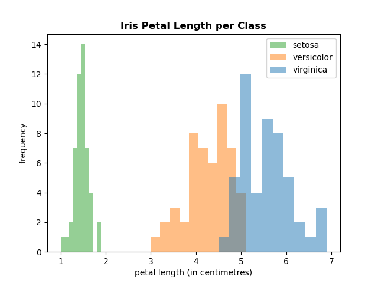

# Programming and Scripting Project: Fisher's Iris Dataset

*Author: Eoghan Walsh*
***
[Programming and Scripting](https://www.gmit.ie/programming-and-scripting) project that uses python to generate histograms and scatter plots to assist with visualization and investigation of Fisher's Iris dataset.

## About the data

[Fisher's Iris dataset](https://en.wikipedia.org/wiki/Iris_flower_data_set), made famous by statistician Ronald Fisher, consists of 150 samples of Iris flower with fifty samples from each of three species: setosa, versicolor and virginica. There are four measurements from each flower: petal length, petal width, sepal length and sepal width.

The dataset is sourced from the [UC Irvine Machine Learning Repository](https://archive.ics.uci.edu/dataset/53/iris) for this project.

## About the project

This project uses python code to complete the following tasks:

1. Generate a summary of the dataset variables and output to a .txt file.

2. Generate a histogram for each variable and output to .png files.

3. Generate and output scatter plots of each pair of variables.

4. Generate and output scatter plots with regression lines and coefficients.

## Software used for the project

- [Anaconda](https://anaconda.org/anaconda/python) Python package.
- [Visual Studio Code](https://code.visualstudio.com/) code editor.

## How to get started with the project

- Import the python modules [pandas](https://pandas.pydata.org/), [numpy](https://numpy.org/), [matplotlib.pyplot](https://matplotlib.org/stable/tutorials/pyplot.html) and [seaborn](https://seaborn.pydata.org/index.html) to the code editor.

    ```python
    import pandas as pd
    import matplotlib.pyplot as plt
    import seaborn as sns
    import numpy as np
    ```

- Import the Iris dataset to the code editor.

    ```python
    column_names = ("sepal_length_cm", "sepal_width_cm", "petal_length_cm",
                    "petal_width_cm", "class")

    iris = pd.read_csv("iris.csv", names=column_names)
    ```

## Examples of what the project does

1. The `variable_summary()` function will generate below summary statistics of the dataset variables and output to a .txt file called iris_variable_summary.txt.

    | |sepal_length_cm|sepal_width_cm|petal_length_cm|petal_width_cm|
    |---|---:|---:|---:|---:|
    |**count**|150.0|150.0|150.0|150.0|
    |**mean**|5.84333|3.05400|3.758666|1.19866|
    |**std**|0.828066|0.433594|1.764420|0.763160|
    |**min**|4.3|2.0|1.0|0.1|
    |**25%**|5.1|2.8|1.6|0.3|
    |**50%**|5.8|3.0|4.35|1.3|
    |**75%**|6.4|3.3|5.1|1.8|
    |**max**|7.9|4.4|6.9|2.5|

***

2. The `histogram_png()` function will generate a histogram for each variable and save as individual .png files.

    *Petal length histogram*

    <div>
    
    </div>

***

3. The below program will generate various scatter plots of the data.

    ```python
    choice = user_menu()
    if choice == "a":
        iris_pairplot()
    elif choice == "b":
        all_plots()
    elif choice == "c":
        x, y = x_y_variables()
        single_plot(x, y)
    ```

    The `user_menu()` function will prompt the user to choose an option in the terminal.
    
    ```console
    What would you like to do?
        (a) Generate pairplot.
        (b) Generate all plots.
        (c) Generate single plot.
        (q) Quit.
    Please enter the letter a, b, c or q:
    ```

    Option **(a)** will call the `iris_pairplot()` function and output a seaborn pairplot.
    
    *seaborn pairplot*

    <div>
    
    </div>
    
    Option **(b)** will call the `all_plots()` function and output scatter plots for all variable pairs one after another.
    
    Option **(c)** will call the `x_y_variables()` function to prompt the user to select the x and y variables and then call the `single_plot()` function to output a single scatter plot.

    ```console
    Please choose x variable from the following:
        petal_length_cm
        petal_width_cm
        sepal_length_cm
        sepal_width_cm
    Enter x axis variable: petal_length_cm

    Please choose y variable from the following:
        petal_length_cm
        petal_width_cm
        sepal_length_cm
        sepal_width_cm
    Enter y axis variable: petal_width_cm
    ```
    
    *Petal length vs petal width scatter plot*

    <div>
    
    </div>

***

4. The below program will call the `x_y_variables()` function to prompt the user to select the x and y variables and call the `coefficients_plot()` function generate scatter plots with regression lines and also display the correlation coefficient $ (r) $ and the coefficient of determination $ (R^{2}) $.

    ```python
    x, y = x_y_variables()
    coefficients_plot(x, y)
    ```

    ```console
    Please choose x variable from the following:
        petal_length_cm
        petal_width_cm
        sepal_length_cm
        sepal_width_cm
    Enter x axis variable: sepal_length_cm

    Please choose y variable from the following:
        petal_length_cm
        petal_width_cm
        sepal_length_cm
        sepal_width_cm
    Enter y axis variable: petal_length_cm
    ```

    *Sepal length vs petal length scatter plots with regression lines*

    <div>
    
    </div>

## References

Iris dataset:
- [Wikipedia](https://en.wikipedia.org/wiki/Iris_flower_data_set)
- [UC Irvine Machine Learning Repository](https://archive.ics.uci.edu/dataset/53/iris)

Python modules:
- [pandas](https://pandas.pydata.org/)
- [numpy](https://numpy.org/)
- [matplotlib.pyplot](https://matplotlib.org/stable/tutorials/pyplot.html)
- [seaborn](https://seaborn.pydata.org/index.html)

Regression lines:
- [Datacamp](https://www.datacamp.com/tutorial/line-plots-in-matplotlib-with-python#adding-a-matplotlib-regression-line-aregr)

Coefficients of Correlation & Determination:
- [StatisticsEasily](https://statisticseasily.com/web-stories/coefficient-of-determination-vs-correlation/)

Pandas:
- [Pandas Cheat Sheet](https://pandas.pydata.org/Pandas_Cheat_Sheet.pdf)

Markdown:
- [Markdown Cheat Sheet](https://github.com/adam-p/markdown-here/wiki/Markdown-Cheatsheet)

***
## End